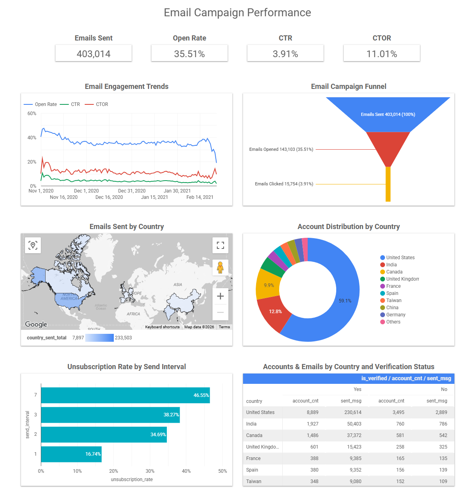

# Email Campaign Performance

SQL project built using Google BigQuery.

## Description

Analyzes account activity, email campaign performance, and country-level rankings.

## Metrics

- Account Activity
- Emails Sent
- Emails Opened
- Emails Clicked
- Country-Level Account Totals
- Country-Level Email Totals
- Top 10 Countries by Account and Email Activity

## SQL

[email_campaign_performance.sql](email_campaign_performance.sql)

## Dashboard

[Open in Data Studio](https://datastudio.google.com/reporting/b54bd244-940a-4418-91e5-e99a3094a201)

