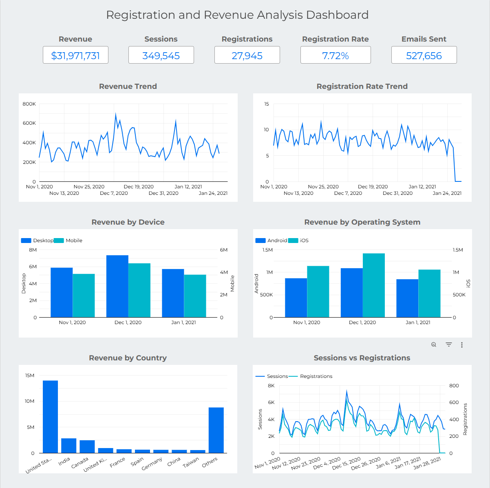

# Registration and Revenue Analysis

SQL project created in Google BigQuery.

## Description

Analyzes registrations, revenue, and email metrics by country and date.

## Metrics

- Revenue
- Sessions
- Registrations
- Registration Rate
- Emails Sent
- Revenue by Device
- Revenue by Operating System

## SQL

[registration_and_revenue.sql](registration_and_revenue.sql)

## Dashboard

[Open in Looker Studio](https://...)

