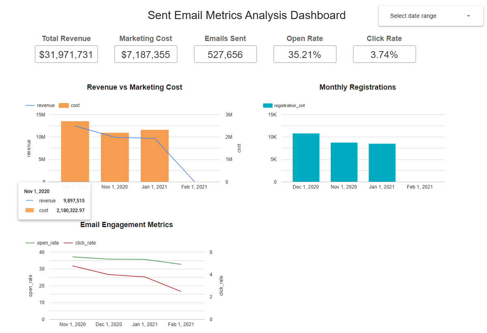

# Sent Email Metrics Analysis

SQL project built using Google BigQuery.

## Description

Analyzes marketing performance and email campaign metrics by month.

## Metrics

- Revenue
- Marketing Cost
- Emails Sent
- Email Open Rate
- Email Click Rate
- Registration Count

## SQL

[sent_email_metrics.sql](sent_email_metrics.sql)

## Dashboard

[Open in Data Studio](https://datastudio.google.com/reporting/d37de29e-8715-4bf3-978d-ddfdd1700fac)

