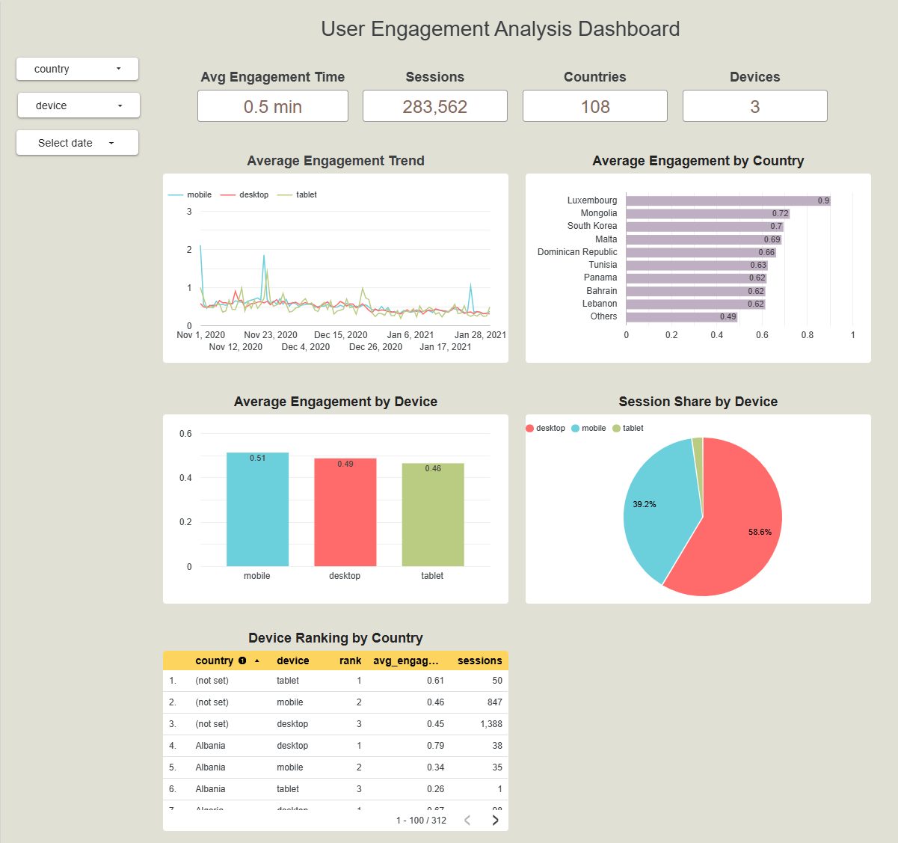

# User Engagement Analysis

SQL project built using Google BigQuery.

## Description

Analyzes user engagement and session metrics by country, device, and date.

## Metrics

- Average Engagement Time
- Sessions
- Session Share by Device
- Average Engagement Time by Country
- Average Engagement Time by Device
- Device Ranking by Country

## SQL

[user_engagement_analysis.sql](user_engagement_analysis.sql)

## Dashboard

[Open in Looker Studio](https://datastudio.google.com/reporting/661c1a6f-8658-4aa6-b68e-56af2577f7a5)

